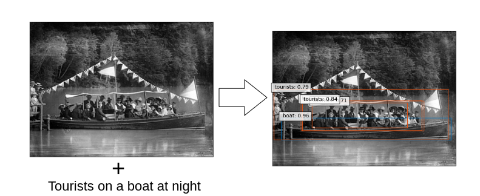
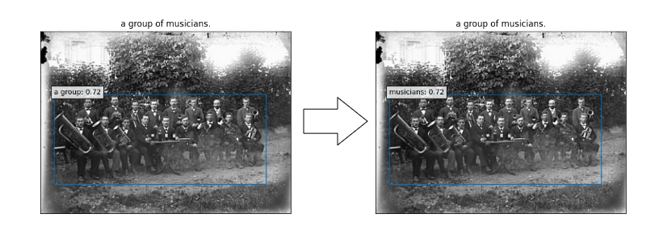
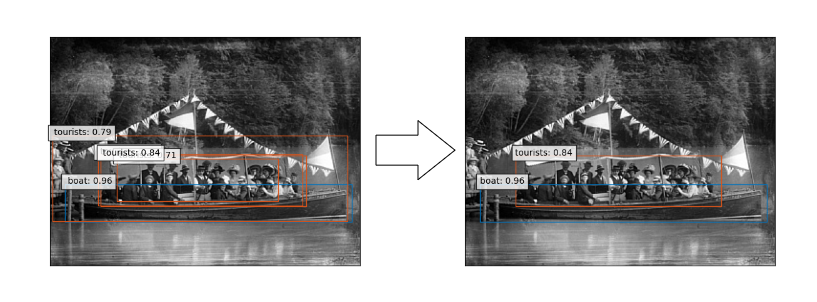
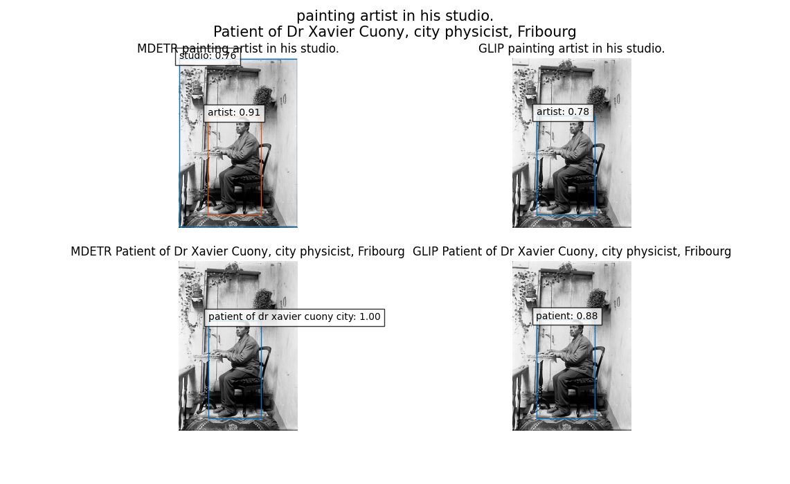
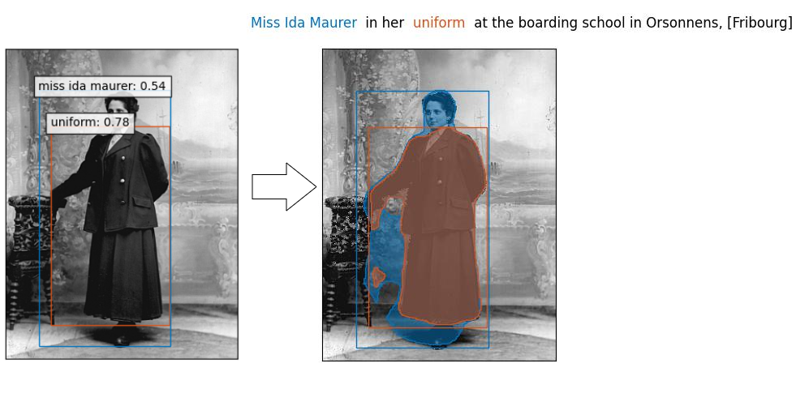

# Heritage in the digital age
>Semester Project @ CVlab &amp; EPFL+ECAL lab 

In this semester project, we explored how heritage can be preserved and shared in the digital age. Our pipeline consists of several steps, including:

1. Translating the titles of images from French to English using a pretrained machine learning model
2. Preprocessing the captions and titles to prepare them for phrase grounding
3. Creating a dataset with the processed captions and titles, as well as the filenames of the images
4. Running inference on the dataset using two state-of-the-art phrase grounding models: GLIP and MDETR
5. Postprocessing the labels to correct for common errors
6. Selecting the best phrase grounding results using a user-friendly GUI
7. Segmenting the detected objects in the images for further analysis

Through this pipeline, we aim to facilitate the preservation and sharing of heritage by providing rich, detailed information about the objects and scenes depicted in images. By bringing the past into the future, we hope to help people better understand and appreciate the cultural heritage that surrounds us.

## Description
In the first step of our pipeline, we use a pretrained machine learning model to translate the titles of images from French to English. 

Next, we preprocess the captions and titles to prepare them for phrase grounding. This involves a variety of tasks, such as casefolding the text and removing expressions such as "portrait of" or "photograph of".

Once the captions and titles have been preprocessed, we create a dataset that includes the filenames of the images, as well as the processed captions and titles. This dataset is then used as input to our phrase grounding models, which are able to detect and label the objects and scenes depicted in the images.

After running inference on the dataset, we postprocess the labels to correct for common errors. This is an important step, as it ensures that the resulting labels are as accurate and informative as possible.

The final step in our pipeline is to select the best phrase grounding results using a user-friendly GUI. This allows users to easily compare the results generated by different models and choose the ones that best fit their needs.

## Detailed Pipeline

### 1: [Title translation](pipeline/1_translate_title.ipynb)
In the first step of our pipeline, we use a [pretrained machine learning model](https://huggingface.co/Helsinki-NLP/opus-mt-fr-en) to translate the titles of images from French to English. 

> Homme (Hermann Nussbaumer) avec son vélo -> Male (Hermann Nussbaumer) with his bike
### 2: [Expression preprocessing](pipeline/2_expression_preprocessing.ipynb)
Next, we preprocess the captions and titles to prepare them for phrase grounding. This involves a variety of tasks, such as casefolding the text and removing expressions such as "portrait of" or "photograph of".

> Portrait of a young couple on their wedding day, [Fribourg] -> a young couple on their wedding day,

### 3: [Dataset creation for phrase grounding](pipeline/3_dataset_creation_for_phrase_grounding.ipynb)
This creates a dictionary with the following entries for each image, with an example:
>* **image** **id** _5_
>* **filename** _'ALNU_00016_2k_324w.jpg'_
>* **caption**
>  * **raw** _'portrait of a man with a bicycle.'_
>  * **preprocessed** _'a man with a bicycle.'_
>* **title**
>  * **raw** _'Male (Hermann Nussbaumer) with his bike'_
>  * **preprocessed** _'male (hermann nussbaumer) with his bike'_

It also creates an archive with every image and the dataset in a pickle format.

### 4: [GLIP](pipeline/4_GLIP_inference.ipynb) & [MDETR](pipeline/4_MDETR_inference.ipynb) Inference
These notebooks are designed to be run on [Google Colab](http://colab.research.google.com/).

1. First the archive created at step 3 is downloaded
2. The pretrained model is loaded
3. Inference is done on every image in the archive
4. The results are uploaded on Google Drive

 

### 5: [Label Postprocessing](pipeline/5_label_postprocess.ipynb)
Often, when an expression is for example "_a group of men in the fields_", the men will be labeled as "group" rather than "men". This notebook fixes this.

### 6: [Selection of the best Phrase Grounding](pipeline/6_selection_best_phrase_grounding.ipynb)
First it applies [NMS](https://arxiv.org/abs/1704.04503) to each inference.

This creates a GUI that shows the four inferences of each image (GLIP + caption, GLIP + title, MDETR + caption, MDETR + title), one image after the other.

The user can press on the following keys:
* **q**: selects the top-left image
* **e**: selects the top-right image
* **a**: selects the bottom-left image
* **d**: selects the bottom-right image
* **p**: pass the image
* **r**: return to the previous image

### 7: [Segmentation](pipeline/7_segmentation.ipynb)
Using the [Segmentation Models](https://github.com/qubvel/segmentation_models.pytorch) library, it does segmentation on each detection from the phrase grounding results.

### 8: [Results Analysis](pipeline/8_results_analysis.ipynb)
Number of selected inferences:

|         | MDETR | GLIP |
|---------|-------|------|
| Caption | 91    | 1130 |
| Title   | 15    | 224  |

GLIP + Caption has been used in 77.4% of images. A simple classification neural network achieve 90.27% accuracy in selecting the right inference, using as features the number of bounding box, the max, their min, max and median area of bounding boxes and the number of words in the caption and the title.
