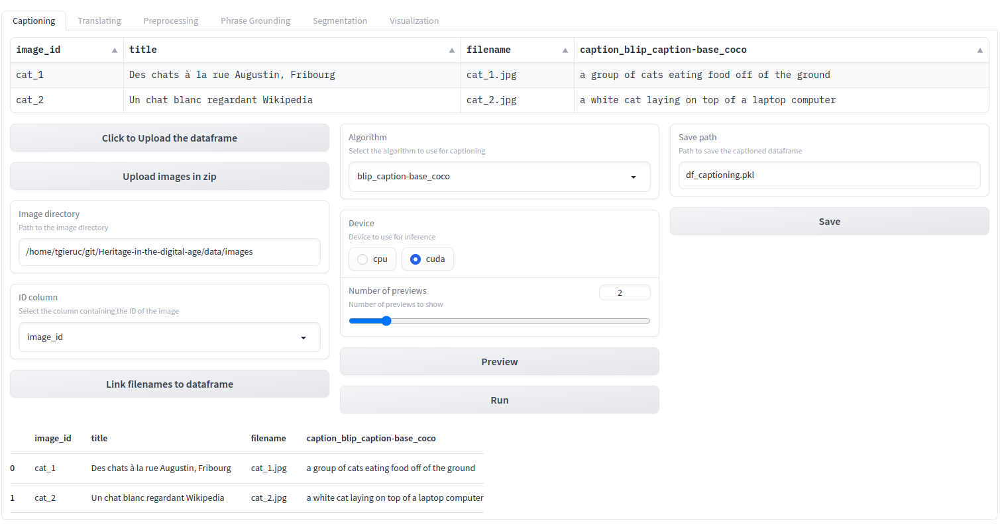
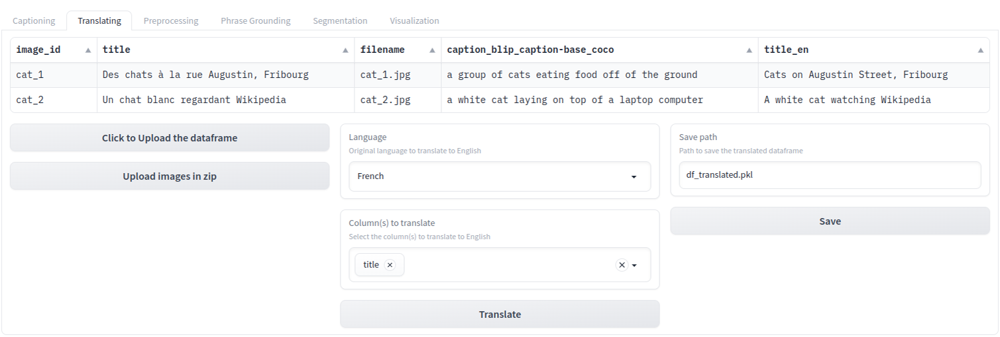

<h1 align="center">Heritage in the digital age</h1>
<h3 align="center"><em>A Step-by-Step Guide to Augmenting Digitized Historical Images, <br> with the help of <a href="https://github.com/salesforce/LAVIS">LAVIS</a>, <a href="https://github.com/IDEA-Research/GroundingDINO">groundingDINO</a> and <a href="https://github.com/facebookresearch/segment-anything">Segment Anything</a> </em></h3>

<h4 align="center"><i>Semester Project @ CVlab &amp; EPFL+ECAL Lab </i></h4>
<h4 align="center"><a href="https://tgieruc.github.io/Heritage-in-the-digital-age/">Visit the Website for the gallery and an explanation of the project!</a></h4>
<p align="center"><a  href="https://colab.research.google.com/github/tgieruc/Heritage-in-the-digital-age/blob/main/WebUI_colab.ipynb"></a></p>
<br>

The project in its original state can be found [here](https://github.com/tgieruc/Heritage-in-the-digital-age/releases/tag/v1.0).


---

WebUI designed for **augmenting** digitized historical images by **generating captions**,  **grounding** the captions and **segmenting** their content. 


## :bulb: Highlights
* Simple WebUI using <a href=https://gradio.app/></a>
* Caption generation using BLIP and BLIP2 <a href=https://github.com/salesforce/LAVIS ></a>
* Translation of captions to English using <a src=https://huggingface.co/Helsinki-NLP>Helsinki-NLP</a>
* Grounding of captions using [:sauropod: groundingDINO](https://github.com/IDEA-Research/GroundingDINO)
* Segmentation of images using <a href=https://github.com/facebookresearch/segment-anything>Segment Anything </a> and  <a href=https://huggingface.co/spaces/tgieruc/agnostic-segmentation)>Agnostic segmentation </a>
* Visualization of the results

### :fire: Caption Generation
<p align="center">
  
</p>

### :fire: Translation
<p align="center">
  
</p>

### :fire: Preprocessing
<p align="center">
  
</p>

### :fire: Phrase Grounding
<p align="center">
  
</p>

### :fire: Segmentation
<p align="center">
  
</p>

### :fire: Visualization
<p align="center">
  
</p>


## Installation

* Clone the repository and its submodules
```bash
git clone --recurse-submodules https://github.com/tgieruc/Heritage-in-the-digital-age.git
```

* Install the dependencies
```bash
bash setup.sh
```

* Run the server
```bash
python3 webui.py
```

## Acknowledgements

Thanks to the following people for their help and their work:
* The caption generation pipeline: [Chenkai Wang](https://github.com/cnWangChenkai)
* The English to French translation model: [MarianMT](https://huggingface.co/Helsinki-NLP/opus-mt-fr-en)
* Captioning: [LAVIS](https://github.com/salesforce/LAVIS)
* Phrase Grounding: [GLIP](https://github.com/microsoft/GLIP), [MDETR](https://github.com/ashkamath/mdetr), [groundingDINO](https://github.com/IDEA-Research/GroundingDINO)
* The NLP model for ranking the expressions: [DistilBERT](https://arxiv.org/abs/1910.01108)
* One segmentation model was created using the [Segmentation Models](https://github.com/qubvel/segmentation_models.pytorch) library
* The other segmentation models from [Segment Anything](https://github.com/facebookresearch/segment-anything)


## Contact

You can reach me [here](mailto:theo.gieruc@gmail.com?subject=%5BHeritage%20in%20the%20Digital%20Age%5D) 😊
