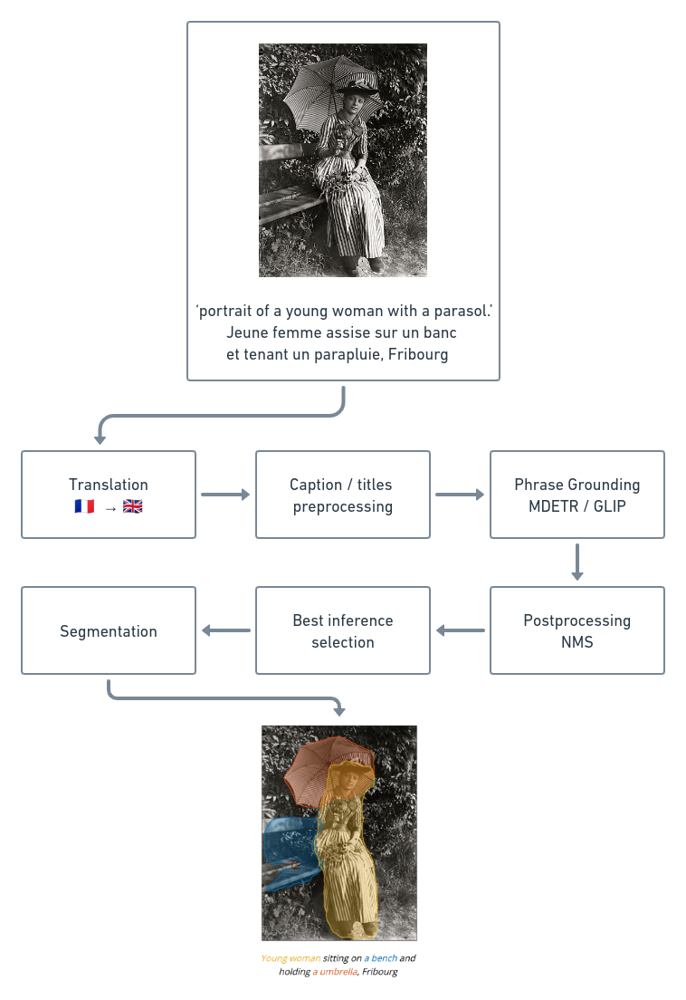
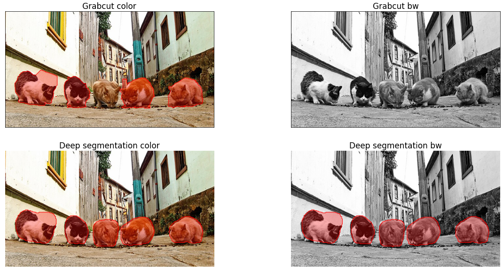
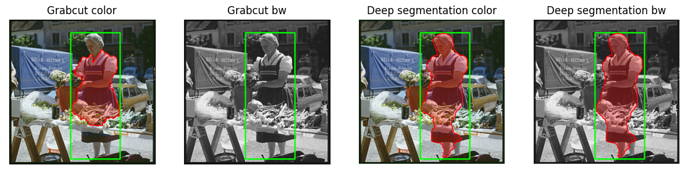
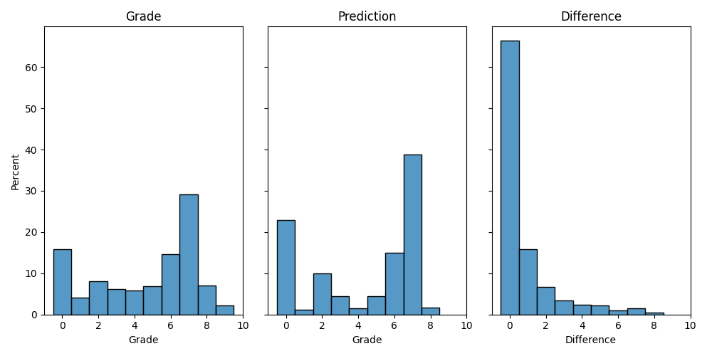

<head>
    

</head>

## Introduction

Many institutions, such as libraries and museums, have begun to digitize their collections in order to make them more accessible to a wider audience. However, the use of these digitized images has typically been limited to remote access and research tools. This projects aims to explore the potential for the valorization of these digitized heritages by augmenting the images with the use of state-of-the-art computer vision and natural language processing techniques.

This project is part of a collaboration between the [EPFL+ECAL Lab](https://epfl-ecal-lab.ch/) and the [Cantonal University Library of the Canton of Fribourg (BCUFR)](https://www.fr.ch/bcu). The dataset used is from the BCUFR, consists of 2,216 pictures from 1870 to 2003, with AI-generated captions and titles in French. The captions have been generated using an image captioning pipeline designed by Chenkai Wang, which consists of two main steps: image captioning with [CLIP](https://openai.com/blog/clip/) and [GPT-2](https://huggingface.co/gpt2) and entity discovery and linking to detect and pair entities.

## The pipeline
The pipeline consists of six steps. It takes as input an image with its title in French and an AI-generated alternative caption in English. 

1. Translating the titles of images from French to English using a pretrained machine learning model
2. Preprocessing the captions and titles to prepare them for phrase grounding
3. Running inference on the dataset using two state-of-the-art phrase grounding models: GLIP and MDETR
4. Postprocessing the phrase grounding results with Non-Maximum Suppression 
5. Selecting the best phrase grounding results using a user-friendly GUI or an automatic selection method
6. Segmenting the detected objects in the images 

{:class="img-responsive"}

### Translating the titles of images
Since the phrase grounding models selected were trained on English captions, the titles of the images need to be translated from French to English. A pretrained machine learning model, [MarianMT](https://huggingface.co/Helsinki-NLP/opus-mt-fr-en), which is a multilingual machine translation model trained on the on the [OPUS](https://opus.nlpl.eu/) corpus, is used for this purpose.

{:class="img-responsive"}

### Preprocessing the captions and titles
The captions and titles are preprocessed in preparation for phrase ground-
ing. This is achieved by converting the text to lowercase and removing the
following expressions: ”portrait of”, ”photograph of” and ”black and white
photo of”.

As this dataset consists of images from Fribourg, there are many mentions
of Fribourg in the title, which can potentially confuse the phrase grounding
models. Therefore, the following mentions were removed: ”canton de fri-
bourg”, ”of fribourg”, ”(fribourg)”, ”[fribourg]” and ”fribourg”.

The expressions ”group of” and ”a group of” have also been removed, as
the phrase grounding algorithms would often give the label ”group” rather
than the subject of the group. For example, with the expression ”a group of
musicians”, the phrase grounding algorithm would choose the label ”group”
rather than ”musicians”.

{:class="img-responsive"}

### Phrase Grounding
Phrase grounding involves detecting the objects in an image that are mentioned in a caption. In this project, two state-of-the-art models were used for this task: [GLIP](https://arxiv.org/abs/2112.03857) (GLIP-L - 430M parameters) and [MDETR](https://arxiv.org/abs/2104.12763) (EfficientNet-B5 - 169M parameters). Inference was run on both the caption and the title for each image.

{:class="img-responsive"}

### Postprocessing the phrase grounding results
Both MDETR and GLIP tend to create several bounding boxes for an object. To address this, [non-maximum suppression (NMS)](https://towardsdatascience.com/non-maximum-suppression-nms-93ce178e177c) is applied, a technique that removes bounding boxes that overlap too much with other bounding boxes. The standard NMS algorithm is used twice: once label-wise with a threshold of 0.5, and once global with a threshold of 0.9.

{:class="img-responsive"}

### Selecting the best phrase grounding results
Each image has four phrase grounding results: two from the caption and two from the title, as it has been run on GLIP and MDETR. The best phrase grounding results are selected using a user-friendly GUI. 

{:class="img-responsive"}

The most selected combination is GLIP on the caption.

|         | MDETR | GLIP |
|---------|-------|------|
| Caption | 91    | 1130 |
| Title   | 15    | 224  |

### Segmenting the detected objects in the images
In order to further augment the images, the detected objects are segmented in the images. The bounding boxes from the phrase grounding results are used to crop the objects and then segment them. Initially, GrabCut was chosen for this task due to its simplicity, but its performance was disappointing, especially on black and white images, which make up the majority of the dataset. GrabCut is based on color information to distinguish between foreground and background pixels. In a black and white image, there is only one color channel, so there is less information available for GrabCut to use in making segmentation decisions. This led to designing a custom class-agnostic segmentation model on PyTorch.

#### Design of the model
The [Segmentation Models](https://github.com/qubvel/segmentation_models.pytorch)  library was used to design the model, which provides a wide range of pretrained segmentation models. The chosen architecture is a  [U-Net](https://arxiv.org/abs/1505.04597) with a [ResNet34](https://arxiv.org/abs/1512.03385) encoder, pretrained on the [Image-Net](https://www.image-net.org/index.php) dataset. This provides a good balance between inference speed and the quality of the segmentation.

#### Fine-tuning
The model was fine-tuned on a subset of the [COCO-2014](https://cocodataset.org/#home) dataset, which consists of 5’000 images with bounding boxes and segmentation masks. The following process was used for fine-tuning the model:

The process of fine-tuning the model is as follows:
* The image is resized to 352x352, normalized, converted to black and white and then turned into a tensor. The bounding box is used to create a mask of the object in the image.
* The image is multiplied by the mask to remove the background and is used as the input to the model. 
* The image is used as the input to the model, and the segmentation ground truth is used as the target for the model.

The model is trained for 100 epochs, using the [Adam](https://arxiv.org/abs/1412.6980) optimizer and the [Dice Loss](https://arxiv.org/abs/1707.03237) as the loss function.

{:class="img-responsive"}

#### Evaluation
The model is evaluated on a [COCO-2014](https://cocodataset.org/#home) validation subset, which consists of 1’000 images with bounding boxes and segmentation masks. It achieves a mean Intersection over Union (IoU) of 0.77, which is calculated as the ratio of the area of overlap between the predicted bounding box or segmentation mask and the ground truth, to the area of union between them:

$$IoU = \frac{(A \cap B)}{(A \cup B)}$$

where $A$ is the predicted bounding box or segmentation mask and $B$ is the ground truth. The IoU score ranges from 0 to 1, with higher values indicating better performance. A mean IoU of 0.77 indicates that the model is performing well but there is still room for improvement.

The model also achieves mean pixelwise precision and recall scores of 0.82 and 0.91, respectively. Pixelwise precision and recall are other common evaluation metrics used in object segmentation, and they measure the fraction of true positive pixels out of all predicted positive pixels (precision), and the fraction of true positive pixels out of all actual positive pixels (recall). These values provide additional insight into the performance of the model and can be used to identify any potential trade-offs between precision and recall. A higher recall than precision seems to indicate that the model is more sensitive to detecting positive pixels but may be less accurate in predicting them. In other words, the model is more likely to identify most of the positive pixels (high recall), but some of the predicted positive pixels may be incorrect (lower precision).

#### Inference
The model was run on the images to segment the detected objects using the bounding boxes from the phrase grounding results. The preprocessing for this step was slightly different from the fine-tuning process: the image was resized to 352x352 with padding, normalized, and then turned into a tensor. After the inference, the segmentation was multiplied by the mask to remove any noise and was resized to the original size of the image.

{:class="img-responsive"}

{:class="img-responsive"}

#### Comparison with GrabCut
A comparison between GrabCut and the deep learning model is shown in in the figure below, on color and black & white images, for one and five inferences. On average, GrabCut takes 259ms per inference, whereas the deep neural net model only needs 47.3ms , which makes it not only better but also faster.

<table class="tg">
<thead>
  <tr>
    <th class="tg-0pky"></th>
    <th class="tg-fymr">1 inference</th>
    <th class="tg-fymr">5 inferences</th>
  </tr>
</thead>
<tbody>
  <tr>
    <td class="tg-fymr">Grabcut</td>
    <td class="tg-0pky">259ms</td>
    <td class="tg-0pky">1.24s</td>
  </tr>
  <tr>
    <td class="tg-fymr">Deep Segmentation Model</td>
    <td class="tg-0pky">47.3ms</td>
    <td class="tg-0pky">143ms</td>
  </tr>
</tbody>
</table>

{:class="img-responsive"}
{:class="img-responsive"}

## Analysis of the results
### Segmentation
The segmentation model performs better on single objects than on groups of objects, as shown in the example below, where the "children" and "students" are better segmented on the right image than on the left.

{:class="img-responsive"}

The number of bounding boxes and their median area were compared between GLIP and MDETR to see which model performs better on phrase grounding.

{:class="img-responsive"}

This shows that GLIP tends to output more bounding boxes than MDETR, and they also tend to be smaller. This suggests that GLIP is a more suitable option, as its bounding boxes would likely lead to better segmentation than MDETR.

### Autmatic selection of the best phrase grounding results
Manually selecting the best inference for each image in a dataset can be time-consuming, especially when dealing with large datasets. To address this issue, several different methods for automatic classification of the best inference were tried.

Both a random forest classifier and a MLP classifier were unable to perform better than always selecting the most popular combination. They were trained using the statistics collected during manual selection as features, such as the number of words in the caption and title, as well as the number of bounding boxes and their minimum, maximum, and median area for each combination of [caption, title] and [GLIP, MDETR].

[DistilBERT-base-uncased](https://huggingface.co/distilbert-base-uncased) with HuggingFace was used for two different approaches:
* Given the caption and the title, the model outputs which one is the best. It was trained on the manual selection data. However, it tends to always prefer the captions over the titles. The model can be found on [HuggingFace](https://huggingface.co/tgieruc/Heritage-in-the-Digital-Age-expression-comparison)
* Given an expression, it ranks it between 0 and 9. Over 400 expressions, extracted randomly from the titles and captions, were manually rated as training and test data. The model was trained for 15 epochs using the Adam optimizer. Overall, the model predicts with an accuracy of 81\% the grade with an error of 1 or less. This model should be used by giving a rating to every caption and title, and then selecting the one with the highest grade. For ease of use, the [model](https://huggingface.co/tgieruc/Heritage-in-Digital-Age-distilbert-base-uncased-expression-rating) and a [pipeline](https://huggingface.co/tgieruc/Heritage-in-the-Digital-Age-expression-ranking-pipeline) have been uploaded on HuggingFace. 

<table class="tg">
<thead>
  <tr>
    <th class="tg-c3ow" colspan="9">Absolute difference with ground-truth </th>
  </tr>
</thead>
<tbody>
  <tr>
    <td class="tg-0pky">0</td>
    <td class="tg-0pky">1</td>
    <td class="tg-0pky">2</td>
    <td class="tg-0pky">3</td>
    <td class="tg-0pky">4</td>
    <td class="tg-0pky">5</td>
    <td class="tg-0pky">6</td>
    <td class="tg-0pky">7</td>
    <td class="tg-0pky">8</td>
  </tr>
  <tr>
    <td class="tg-0pky">66.5%</td>
    <td class="tg-0pky">15.9%</td>
    <td class="tg-0pky">6.6%</td>
    <td class="tg-0pky">3.4%</td>
    <td class="tg-0pky">2.4%</td>
    <td class="tg-0pky">2.2%</td>
    <td class="tg-0pky">0.97%</td>
    <td class="tg-0pky">1.4%</td>
    <td class="tg-0pky">0.5%</td>
  </tr>
</tbody>
</table>

{:class="img-responsive"}

# Gallery 

  
    
      
      
      

        
        
{{ caption }}

      

    
  

<!-- CSS for the gallery -->

  
    
      
      
      

        
        
{{ caption }}

      

    
  

<!-- CSS for the gallery -->

