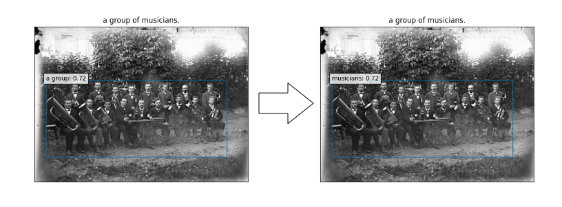

<head>
    

</head>

## Introduction
Many institutions, such as libraries and museums, have began to digitize their collections, but most of the use of those images have been limited to remote access and research tools. This project aims to explore the potential for the valorization of these digitized heritages, to create a more interesting, interractive and fun way to explore the collections, by augmenting the images with the use of state-of-the-art computer vision and natural language processing techniques. 

This project is part of the colaboration between the EPFL+ECAL Lab and the [Cantonal University Library of the Canton of Fribourg (BCUFR)](https://www.fr.ch/bcu). I will be using a dataset from the BCU, consisting of 2'216 pictures from 1870 to 2003, with their title in French and a AI-generated alternative caption. These captions have been generated using an image-captionning pipeline, designed by Chenkai Wang. The pipeline consists of two main steps: image captioning with CLIP and GPT-2 and entity discovery and linking to detect and pair entities. 

## The pipeline
Our pipeline consists of six steps: 

1. Translating the titles of images from French to English using a pretrained machine learning model
2. Preprocessing the captions and titles to prepare them for phrase grounding
3. Running inference on the dataset using two state-of-the-art phrase grounding models: GLIP and MDETR
4. Postprocessing the phrase grounding results to correct for common errors
5. Selecting the best phrase grounding results using a user-friendly GUI
6. Segmenting the detected objects in the images 

### Translating the titles of images
As the phrase grounding models were trained on English captions, we need to translate the titles of the images from French to English. This is done using a pretrained machine learning model, [MarianMT](https://huggingface.co/Helsinki-NLP/opus-mt-fr-en), which is a multilingual machine translation model trained on the [OPUS](https://opus.nlpl.eu/) corpus. 

{:class="img-responsive"}

### Preprocessing the captions and titles
The captions and titles are preprocessed to prepare them for phrase grounding. This is done by removing punctuation, numbers and special characters, converting the text to lowercase and removing expressions such as "a picture of", "a view of" and "a photograph of". 
As this dataset consists of images from Fribourg, I also removed all mentions of the city of Fribourg. 

{:class="img-responsive"}

### Phrase Grounding
Phrase grounding consists in detecting the objects in an image that are mentioned in a caption. Two models were used for this task: [GLIP](https://arxiv.org/abs/2112.03857) and [MDETR](https://arxiv.org/abs/2104.12763) and inference was run on both the caption and the title for each image.

{:class="img-responsive"}

### Postprocessing the phrase grounding results
Two steps were taken to postprocess the phrase grounding results: non-maximum suppression and fixing common error on labels.

* [Non-maximum suppression](https://towardsdatascience.com/non-maximum-suppression-nms-93ce178e177c): This step consists in removing bounding boxes that overlap too much with other bounding boxes. This is done to avoid having multiple bounding boxes for the same object. 

{:class="img-responsive"}

* Fixing the *group* label: The phrase grounding models tend to use the word *group* as a label, rather than the noun following. This is fixed by checking if the word *group* is followed by a noun and if it is, the label is changed to the noun.

{:class="img-responsive"}

### Selecting the best phrase grounding results
Each image has four phrase grounding results: two from the caption and two from the title, as it has been run on GLIP and MDETR. The best phrase grounding results are selected using a user-friendly GUI. 

{:class="img-responsive"}

The most selected combination is GLIP on the caption.

|         | MDETR | GLIP |
|---------|-------|------|
| Caption | 91    | 1130 |
| Title   | 15    | 224  |

### Segmenting the detected objects in the images
#### Design of the model
In order to further augment the images, the detected objects are segmented in the images. It would use the bounding boxes from the phrase grounding results to crop the objects and then segment them.

This is done using the [Segmentation Models](https://github.com/qubvel/segmentation_models.pytorch) library, which provides a wide range of pretrained segmentation models.

The chosen architecture is a [U-Net](https://arxiv.org/abs/1505.04597) with a [ResNet34](https://arxiv.org/abs/1512.03385) encoder, pretrained on the [Image-Net](https://www.image-net.org/index.php) dataset. 

#### Fine-tuning
The model is fined-tuned on a subset of the  [COCO-2014](https://cocodataset.org/#home) dataset, which consists of 50'000 images with bounding boxes and segmentation masks.

The process of fine-tuning the model is as follows:
* The image is resized to 352x352, normalized, converted to black and white and then turned into a tensor. The bounding box is used to create a mask of the object in the image. 
* The image is multiplied by the mask to remove the background and is used as the input to the model. 
* The segmentation ground-truth is used as the target for the model.

The model is trained for 100 epochs, using the [Adam](https://arxiv.org/abs/1412.6980) optimizer and the [Dice Loss](https://arxiv.org/abs/1707.03237) as the loss function.

{:class="img-responsive"}

#### Evaluation
The model is evaluated on a [COCO-2014](https://cocodataset.org/#home) validation subset, which consists of 1'000 images with bounding boxes and segmentation masks. It achieves a mean IoU of 0.77, a mean precision of 0.82 and a mean recall of 0.91.
#### Inference
The model is run on the images to segment the detected objects, using the bounding boxes from the phrase grounding results. The preprocessing is slightly different from the fine-tuning process: the image is resized to 352x352 with padding, normalized and then turned into a tensor. After the inference, the segmentation is multiplied by the mask to remove any noise and is resized to the original size of the image.

{:class="img-responsive"}

## Analysis of the results
### Segmentation
The segmentation model performs better on single objects than on groups of objects, as shown in the example below, where the "children" and "students" are better segmented on the left image than on the right image.

{:class="img-responsive"}

We can compare the number of bounding boxes and their median area between GLIP and MDETR, in order to see which model performs better on phrase grounding:

{:class="img-responsive"}

GLIP tends to have a higher number of bounding boxes per images than MDETR, and their median area is smaller. This means that GLIP has a tendency to detect each instance of an label, while MDETR tends to detect the whole group of objects. This would make GLIP better for segmentation, as the segmentation model perform better on single objects than on groups of objects.

### Autmatic selection of the best phrase grounding results
In order to work on bigger datasets, the automatic selection of the best phrase grounding results is necessary. The GUI used to select the best phrase grounding results was designed for a few images, but it would be too time-consuming to use it on a bigger dataset.

The autmatic selection of the best phrase grounding results is done using a simple classifier neural netowrk, based on the number of words in the caption and the title, the number of bounding boxes as well as their min, max and median area, for each combination of [caption, title] and [GLIP, MDETR]. 

The model is trained on 1'095 images and tested on 365 different images. It achieves an accuracy of 90.03% on the test set, whereas always selecting the most-selected combination (GLIP + caption) would only achieve an accuracy of 77.39%.

# Gallery 

  
    
      
      
      

        
        
{{ caption }}

      

    
  

<!-- CSS for the gallery -->

  
    
      
      
      

        
        
{{ caption }}

      

    
  

<!-- CSS for the gallery -->

